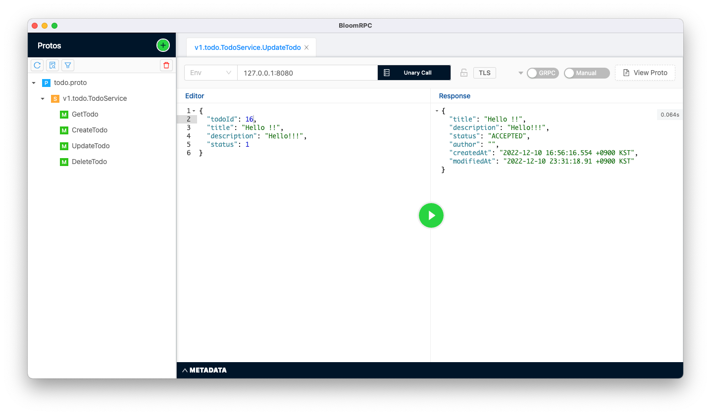

# Go gRPC 연습

## pb 파일 생성

`go-grpc-study` 폴더에서 아래 명령어 실행
```shell
 protoc -I ./protos/v1/todo \
 --go_opt=paths=source_relative \
 --go_out=./protos/v1/todo \
 --go-grpc_opt=paths=source_relative \
 --go-grpc_out=./protos/v1/todo \
 ./protos/v1/todo/todo.proto
```

## 기술 스택
- Go 1.18
- grpc protocol
- uber-fx (dependency injection framework)
- zap-logger (structural logging framework)
- gorm (golang orm framework)
- mysql

## 설명
gRPC 서버 공부를 위하여 간단한 Todo 객체를 MySQL에 저장하고 조회하는 프로젝트입니다.

## 실행
1. 실행 환경 `APP_PROFILE` 환경변수 설정
  - DEV
  - STAGE
  - PROD

2. 실행 환경 프로필 정보 설정 `/profile/application-${APP_PROFILE}.yaml`
```yaml
server:
  port: 8080 # grpc server port

database:
  user: root # mysql userid
  password: admin # mysql password
  database-name: woony # mysql database-name
```

## 테스트
gRPC Test Client Bloom RPC 사용

